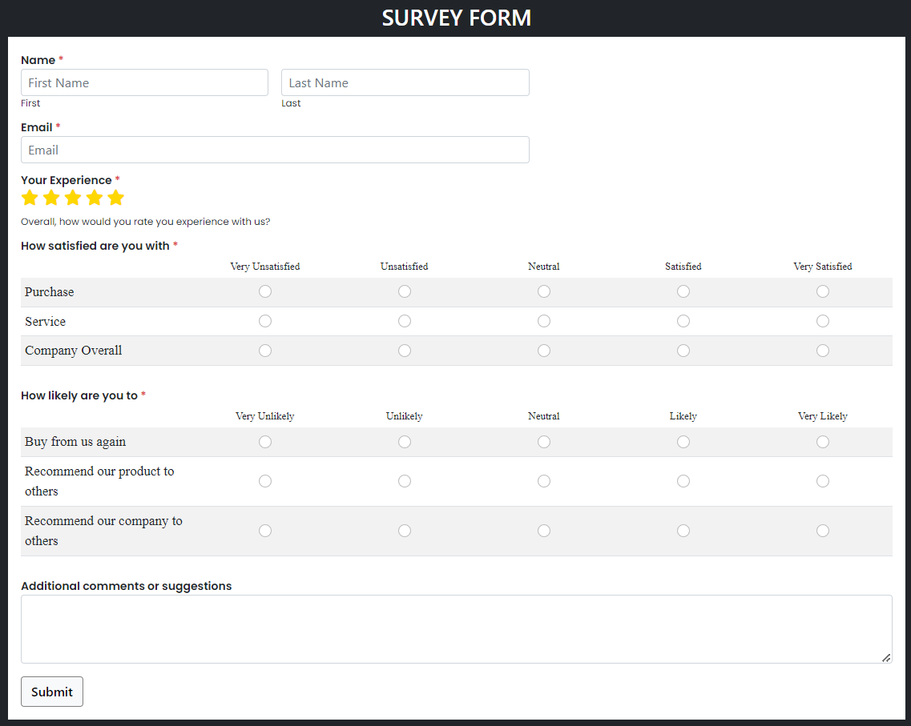

# Survey Form

A responsive survey form designed to collect user feedback, built with HTML, CSS, Bootstrap, and Font Awesome.

## Features

- Collects user's name, email, and feedback ratings.
- Multiple choice radio buttons for satisfaction and likelihood questions.
- Responsive design for various screen sizes.
- Styled with Bootstrap for enhanced UI.

## Technologies Used

- HTML
- CSS
- Bootstrap 5

## Conclusion

This project demonstrates building a responsive survey form using modern web technologies. 
